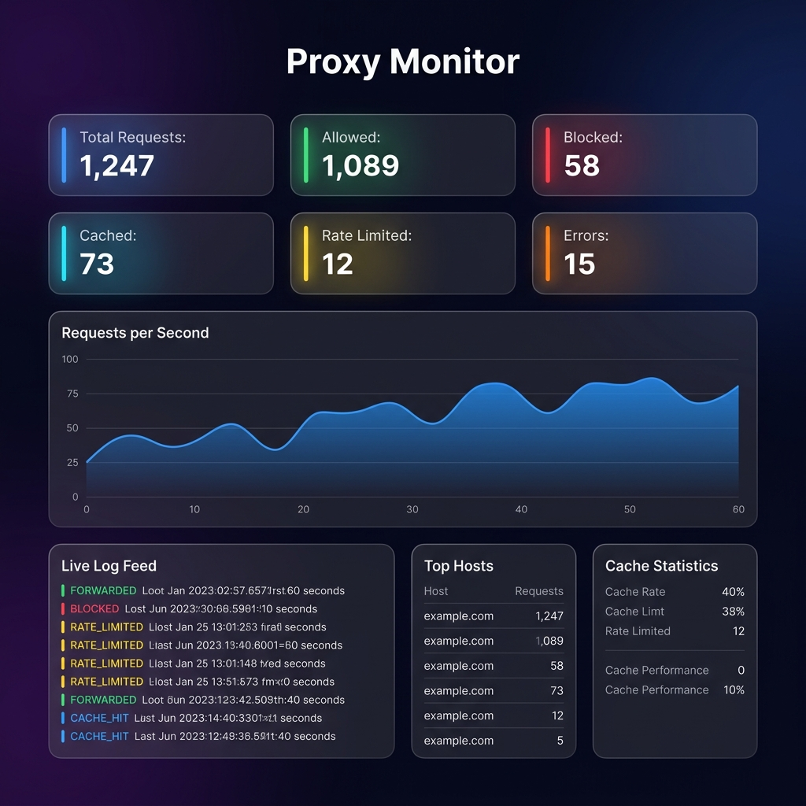
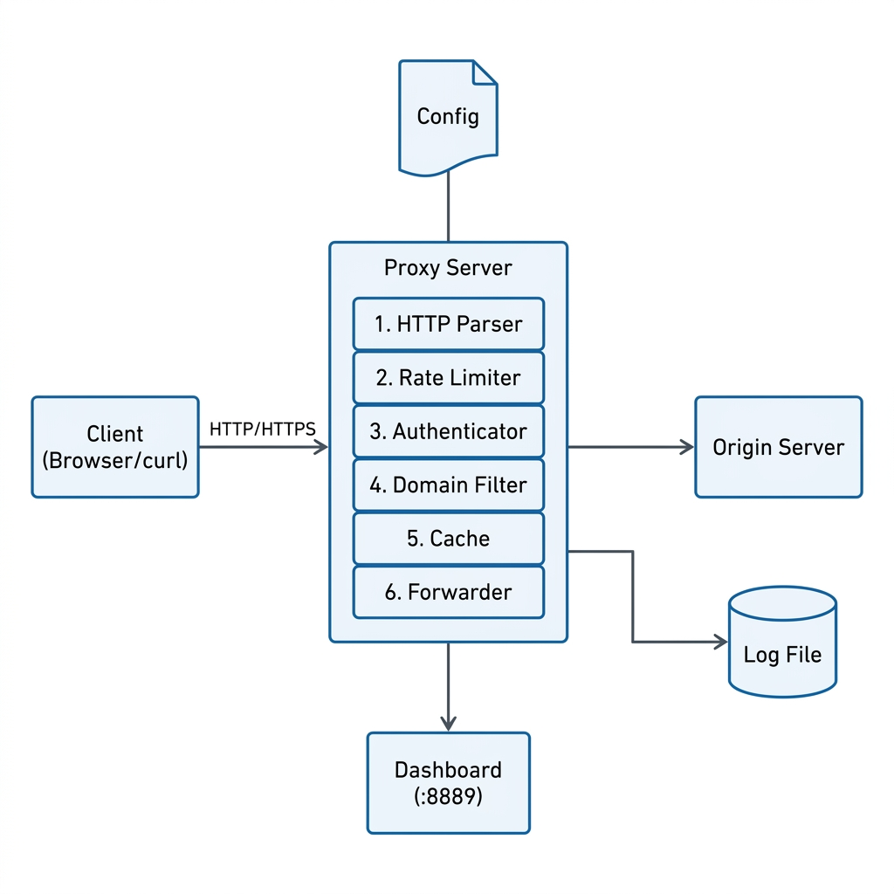
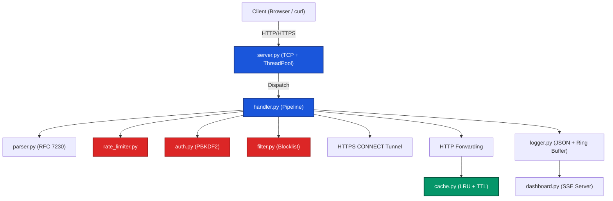
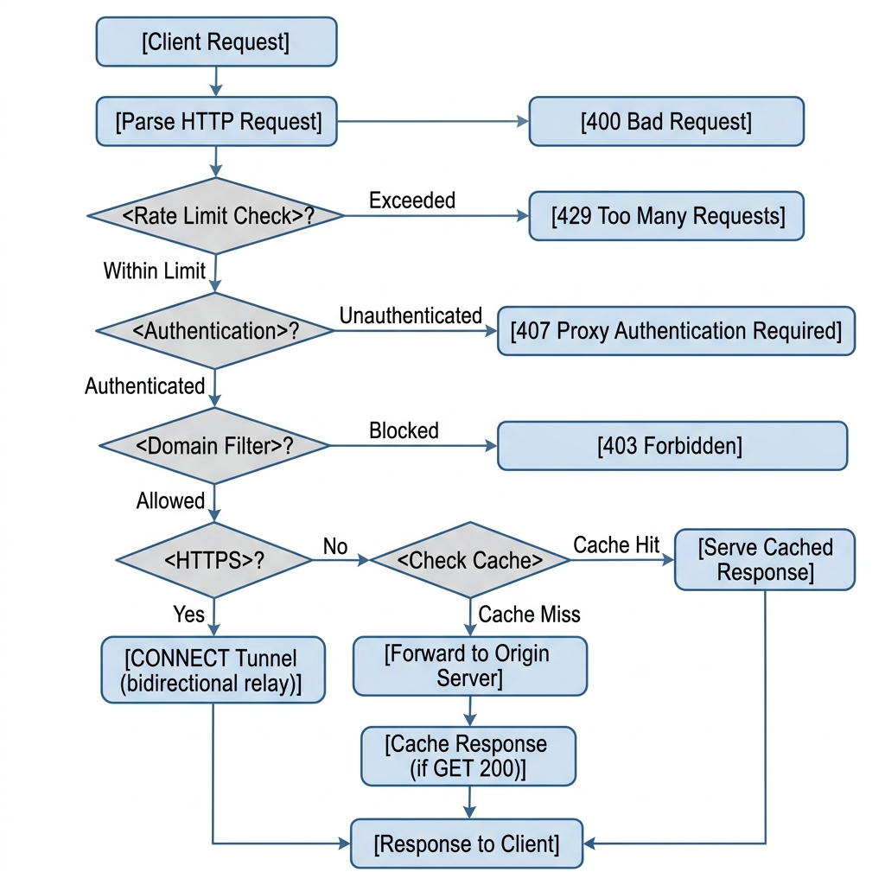
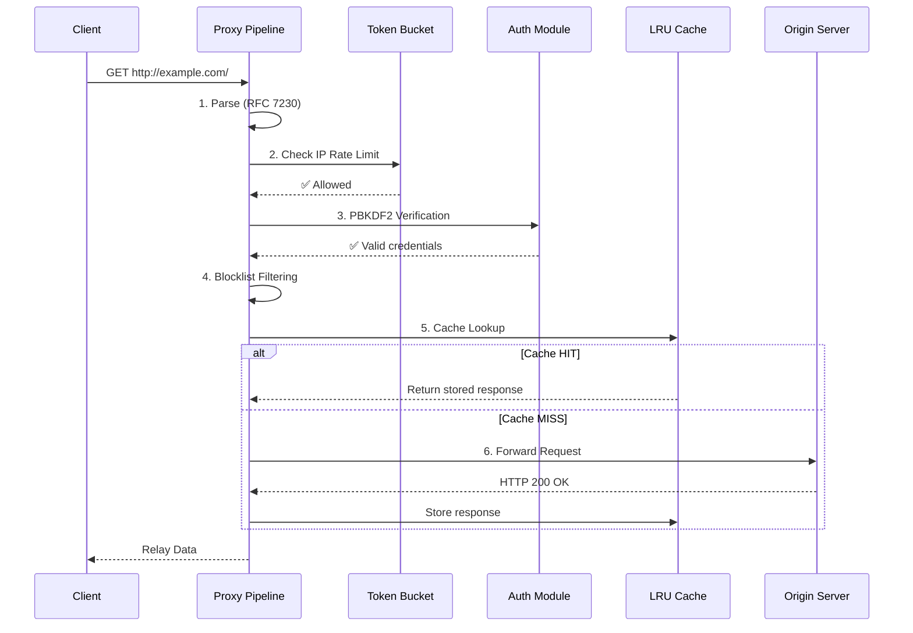
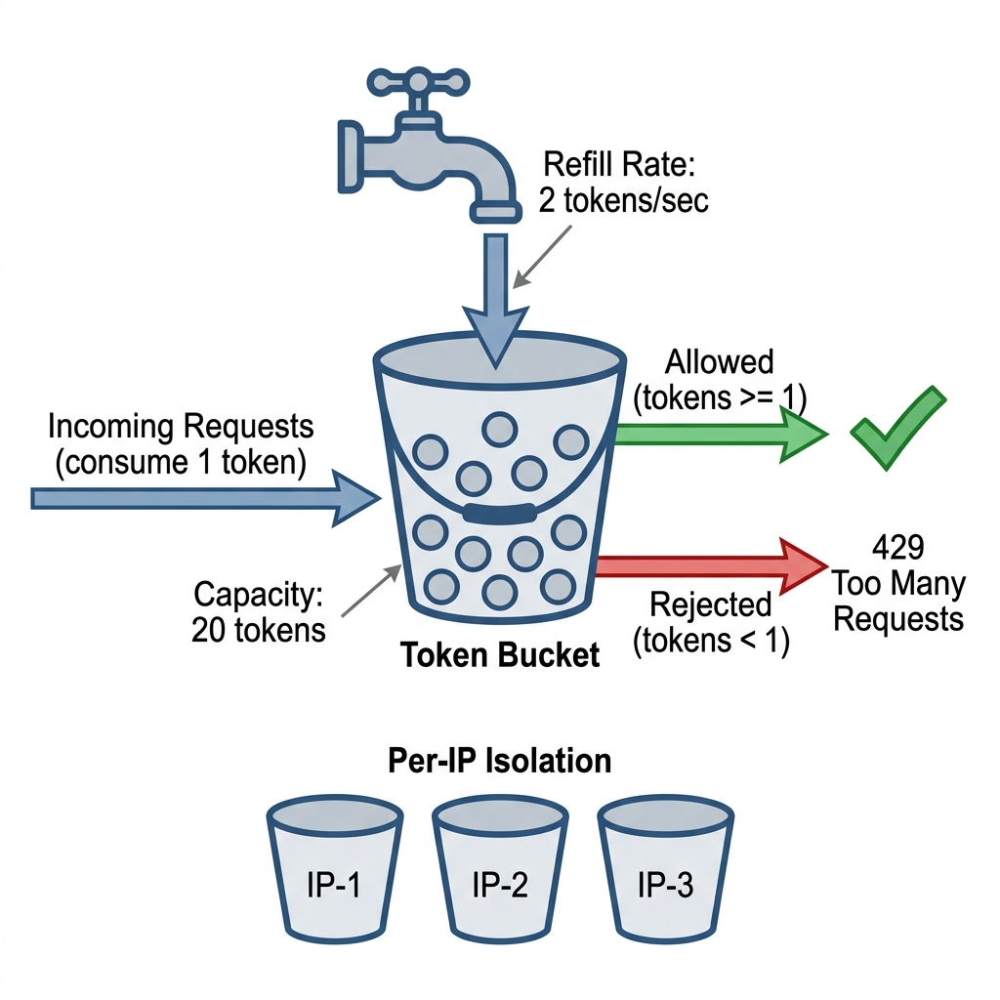
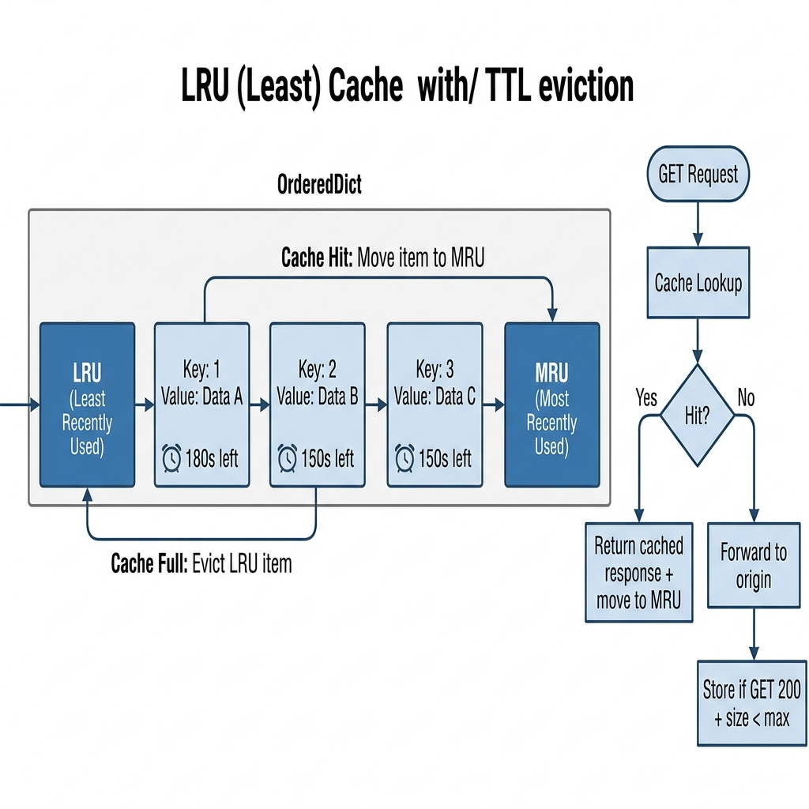

<div align="center">


<h1>🛡️ Custom Network Proxy Server</h1>
<p><strong>A masterclass in Python socket programming. Zero dependencies. Total control.</strong></p>

<p>
  <a href="https://www.python.org/"></a>
  
  
  
</p>

---

</div>

## 🌌 The Vision

Most proxy implementations are either basic textbook echo servers or massive, opaque binaries like Nginx or Squid. **This project bridges the gap.** It is a production-grade forward proxy server built entirely from scratch using only the Python standard library. 

It implements complex enterprise-level concepts—Token Bucket rate limiting, PBKDF2 cryptographic authentication, thread-safe LRU caching, and real-time SSE observability—exposing the raw mechanics of network engineering. **No black boxes. No `pip install`. Pure engineering.**

---

## 📸 Real-Time Observability Dashboard

A proxy is only as good as its visibility. The built-in dashboard (running on `:8889`) provides Server-Sent Events (SSE) streaming for real-time telemetry, cache statistics, and color-coded JSON logs.

<div align="center">
  
</div>

---

## 🏗️ System Architecture

The server utilizes a bounded `ThreadPoolExecutor` concurrency model, capable of handling high loads without resource exhaustion. Shared states (caching, rate limiting, logging) are tightly managed using fine-grained threading locks.

<div align="center">
  
</div>

### 🧬 Component Interaction Graph
For a deeper look, here is the component dependency tree:



---

## 🛤️ The Request Pipeline

Every incoming connection is passed through a strict, deterministic 6-step pipeline.

<div align="center">
  
</div>

### 🔍 Pipeline Execution Flow



---

## ⚙️ Core Engineering Deep Dives

<details>
<summary><strong>🛡️ 1. Cryptographic Authentication (PBKDF2)</strong></summary>
<br>

Passwords are never stored in plaintext. The proxy implements **PBKDF2-HMAC-SHA256** following strict NIST SP 800-132 guidelines.
- **Iterations:** 600,000 (OWASP 2024 standards)
- **Salting:** 32-byte cryptographic randomness per user.
- **Validation:** Constant-time `hmac.compare_digest` to prevent timing side-channel attacks.
</details>

<details>
<summary><strong>🚦 2. Rate Limiting (Token Bucket)</strong></summary>
<br>


To prevent resource abuse, the system implements a strict per-IP token bucket algorithm.
- Supports sudden traffic bursts up to a defined **Capacity**.
- Replenishes tokens at a continuous **Refill Rate**.
- Rate limiting is strategically executed **before** authentication to prevent computationally expensive PBKDF2 DDoS attacks.
- Returns `429 Too Many Requests` with a compliant `Retry-After` header.
</details>

<details>
<summary><strong>🧠 3. Thread-Safe LRU Caching</strong></summary>
<br>


Optimizing throughput via an in-memory `collections.OrderedDict` ensuring $O(1)$ operations.
- Triggers strictly on `HTTP GET` yielding `200 OK`.
- **TTL Eviction:** Lazily evaluated on access to eliminate the need for sweeping background threads.
- Implements maximum object size thresholds to prevent heap monopolization.
</details>

<details>
<summary><strong>📜 4. Structured JSON Logging</strong></summary>
<br>

Observability relies on structured data. Every request generates a deterministic JSON `LogEntry`:
```json
{
  "timestamp": "2026-06-12T03:00:01.123+00:00",
  "level": "INFO",
  "request_id": "a1b2c3d4-e5f6-7890-abcd-ef1234567890",
  "client_ip": "192.168.1.10",
  "method": "GET",
  "host": "example.com",
  "action": "FORWARDED",
  "status_code": 200,
  "latency_ms": 45.2,
  "bytes_transferred": 15234
}
```
Logs are broadcast to the terminal (human-readable), disk (JSON with 1MB atomic rotation), and a ring buffer (feeding the SSE Dashboard).
</details>

---

## 🚀 Getting Started

### Prerequisites
- **Python 3.10+**
- *Zero `pip install` required.*

### 1. Launch the Server
```bash
git clone https://github.com/Krit-Jain/Custom-Network-Proxy-Server.git
cd Custom-Network-Proxy-Server
python src/server.py
```
> **Notice**: The proxy natively binds to `0.0.0.0:8888` and launches the Dashboard on `0.0.0.0:8889`.

### 2. Route Traffic
Test the robust interception capabilities utilizing `curl`:

```bash
# Standard HTTP (Cacheable)
curl -x localhost:8888 -U admin:admin123 http://neverssl.com

# Opaque HTTPS Tunneling
curl -x localhost:8888 -U admin:admin123 https://www.google.com

# Trigger the Blocklist
curl -x localhost:8888 -U admin:admin123 http://example.com
```

### 3. User Management
Securely provision access credentials:
```bash
python tools/manage_users.py add <username> <password>
python tools/manage_users.py list
```

---

## 🧪 Comprehensive Verification

Production code requires rigorous proof. The repository contains **43 isolated tests** yielding near-total coverage over networking edge-cases, pipeline logic, and security.

| Suite Area | Assertions | Focus |
|:---|:---|:---|
| **Parser Validation** | 9 Tests | Malformed payloads, absolute-URI transformations, chunk boundaries |
| **Auth Cryptography** | 7 Tests | Salt uniqueness, PBKDF2 permutations, constant-time validation |
| **Token Bucket** | 7 Tests | Capacity bursting, multi-thread concurrency safety |
| **LRU Cache** | 6 Tests | $O(1)$ LRU eviction, exact TTL invalidation |
| **E2E Integration** | 8 Tests | 50-thread concurrent flooding, blocklist triggering |

Execute the suite:
```bash
python -m unittest tests.test_proxy -v
```

---

## 📖 Deep Documentation

Explore the intricate design details via the foundational engineering docs:
- [Architecture & Protocol Design (`design.md`)](docs/design.md)
- [Formal Project Report (`Project_Report.pdf`)](docs/Project_Report.pdf)

---

<div align="center">
  <p>Built with precision by <strong>Krit Jain</strong>.</p>
</div>