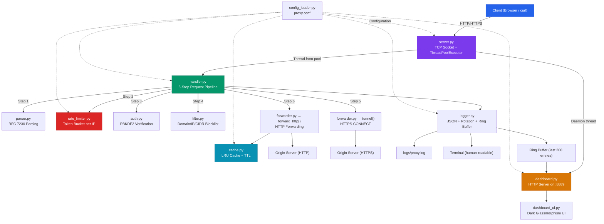
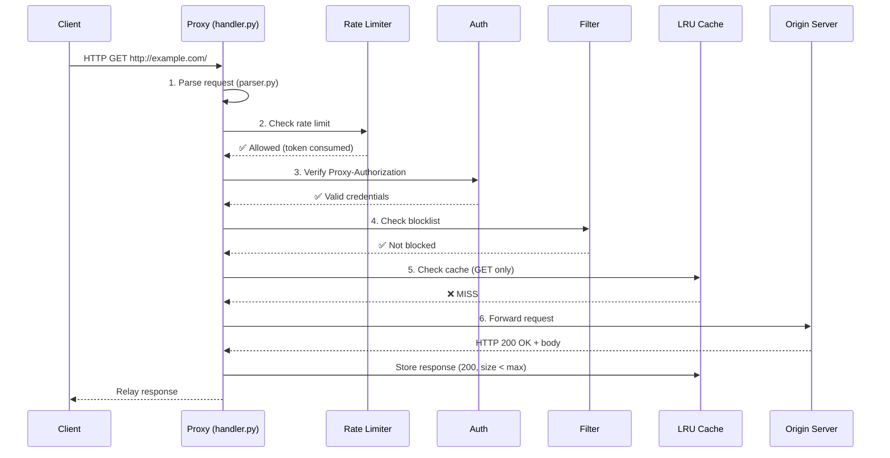
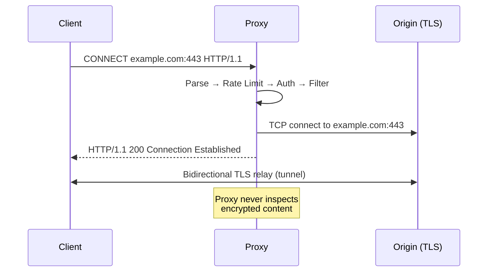
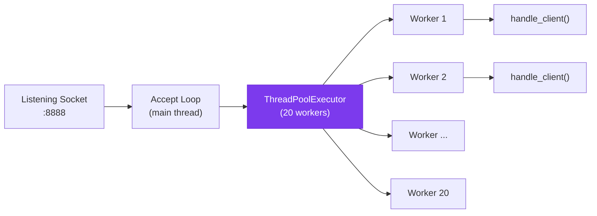
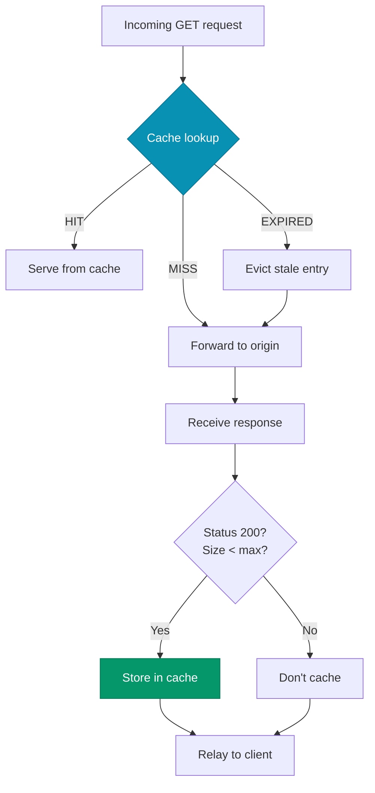
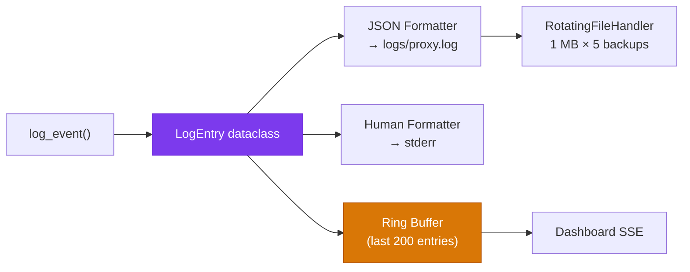

# Design and Implementation of a Custom Network Proxy Server

## 1. Overview

This project implements a **production-grade forward proxy server** supporting both HTTP and HTTPS traffic. Built with low-level socket programming in Python, it demonstrates real-world networking concepts including concurrent connection management, secure authentication, request filtering, response caching, rate limiting, structured logging, and live monitoring.

The implementation prioritizes **correctness, security, and observability** — going beyond a textbook proxy to deliver features expected of production systems.

---

## 2. Architecture

The proxy follows a **modular, layered architecture** where each component has a single responsibility. The request pipeline is clearly defined and each layer can be understood, tested, and modified independently.

### Component Overview

| Module | Responsibility |
|---|---|
| `server.py` | TCP socket, thread pool, graceful shutdown |
| `handler.py` | Request pipeline orchestration (6-step pipeline) |
| `parser.py` | HTTP request parsing (RFC 7230) |
| `forwarder.py` | HTTP forwarding + HTTPS CONNECT tunneling |
| `filter.py` | Domain/IP/CIDR blocklist with hot-reload |
| `cache.py` | Thread-safe LRU cache with TTL eviction |
| `logger.py` | Structured JSON logging with rotation + ring buffer |
| `log_schema.py` | Canonical `LogEntry` dataclass for all events |
| `rate_limiter.py` | Per-IP token bucket rate limiting |
| `auth.py` | PBKDF2-HMAC-SHA256 password hashing + verification |
| `config_loader.py` | INI config parser with typed defaults |
| `dashboard.py` | Real-time monitoring HTTP server (SSE) |
| `dashboard_ui.py` | Self-contained dashboard HTML/CSS/JS |

### Architecture Diagram



---

## 3. Request Pipeline

Every client connection passes through a 6-step pipeline in `handler.py`:

### HTTP Request Flow



### HTTPS CONNECT Flow



### Rejection Flows

| Step | Failure | Response Code |
|------|---------|---------------|
| 1. Parse | Malformed request | `400 Bad Request` |
| 2. Rate Limit | Bucket empty | `429 Too Many Requests` + `Retry-After` |
| 3. Auth | Missing/invalid credentials | `407 Proxy Authentication Required` |
| 4. Filter | Blocked domain/IP | `403 Forbidden` |
| 5/6. Forward | Origin unreachable | `502 Bad Gateway` |

---

## 4. Concurrency Model



- **Bounded thread pool** (`ThreadPoolExecutor`) replaces unbounded thread-per-connection
- Pool size configurable via `proxy.conf` (`thread_pool_size = 20`)
- When the pool is saturated, connections queue in the executor
- OS-level `socket.listen(50)` backlog acts as secondary bound
- All shared resources (cache, metrics, blocklist) are protected by locks

---

## 5. Authentication

### Security Properties

| Property | Implementation |
|---|---|
| Algorithm | PBKDF2-HMAC-SHA256 (NIST SP 800-132) |
| Iterations | 600,000 (OWASP 2024 recommendation) |
| Salt | 32-byte random per user |
| Key length | 32 bytes |
| Comparison | Constant-time (`hmac.compare_digest`) |
| Storage | `config/users.txt` with format `username:pbkdf2$iter$salt$hash` |

### Authentication Flow

1. Client sends `Proxy-Authorization: Basic <base64(user:pass)>` header
2. Proxy decodes Base64, splits username and password
3. Looks up stored hash for username in `USERS` dict
4. Calls `auth.verify_password(plain, stored)` — PBKDF2 comparison
5. Returns `407` on failure, proceeds to filtering on success

### User Management

```bash
python tools/manage_users.py add <username> <password>
python tools/manage_users.py remove <username>
python tools/manage_users.py list
python tools/manage_users.py migrate   # Convert plaintext → PBKDF2
```

---

## 6. Filtering

- Blocklist loaded **once at startup** into memory (not per-request)
- Thread-safe hot-reload via `reload_blocklist()`
- Supports:
  - Exact domain match (`example.com`)
  - Subdomain suffix match (`sub.example.com` → matches `example.com`)
  - Exact IP match (`192.0.2.5`)
  - CIDR range match (`192.168.0.0/24`)
- All hostnames canonicalized to lowercase

---

## 7. Caching

### Design

- **LRU eviction** using `collections.OrderedDict` (O(1) operations)
- **TTL expiration** checked lazily on `get()` (no background sweeper)
- Only **HTTP GET** requests with **200 OK** responses are cached
- HTTPS traffic is never cached (proxy cannot inspect TLS content)
- Per-object size limit prevents large responses from dominating cache

### Cache-Aside Pattern



### Observability

Cache stats (hits, misses, evictions, hit rate %, current size) are tracked atomically and exposed via the dashboard API.

---

## 8. Rate Limiting

### Algorithm: Token Bucket

Each client IP gets its own token bucket:

| Parameter | Default | Description |
|---|---|---|
| `capacity` | 20 | Maximum burst size (tokens) |
| `refill_rate` | 2.0 | Tokens restored per second |
| `stale_threshold` | 600s | Prune inactive buckets after 10 min |

### Implementation Details

- Fine-grained locks: global lock for bucket registry, per-bucket locks for token operations
- Stale bucket pruning runs at most once per minute
- Rate limit check happens **before authentication** (fail-fast protection against brute-force)
- `429 Too Many Requests` response includes `Retry-After` header

---

## 9. Structured Logging

### Dual-Output Architecture



### Log Entry Schema

Every event uses the canonical `LogEntry` dataclass:

```json
{
  "timestamp": "2026-06-12T03:00:01.123+00:00",
  "level": "INFO",
  "event": "FORWARDED",
  "message": "FORWARDED → example.com:80/ [200] (1234B, 45.2ms)",
  "request_id": "a1b2c3d4-e5f6-7890-abcd-ef1234567890",
  "client_ip": "192.168.1.10",
  "method": "GET",
  "host": "example.com",
  "port": 80,
  "path": "/",
  "action": "FORWARDED",
  "status_code": 200,
  "latency_ms": 45.2,
  "bytes_transferred": 1234
}
```

### Log Rotation

- Size-based rotation at 1 MB (configurable)
- 5 backup files retained (`proxy.log.1` through `proxy.log.5`)
- Uses stdlib `RotatingFileHandler` for atomic rotation

---

## 10. Real-Time Dashboard

A stunning web dashboard accessible at `http://localhost:8889` provides:

- **Live counters**: Total / Allowed / Blocked / Cached / Rate-Limited / Errors
- **Requests/sec chart**: Real-time line graph (last 60 seconds)
- **Live log feed**: Color-coded request stream (green=ALLOW, red=BLOCK, yellow=RATE_LIMIT, blue=CACHE_HIT)
- **Cache stats panel**: Entries, hit rate, size
- **Top hosts table**: Most requested domains
- **Rate limiter status**: Active buckets, capacity

### Technology

- Pure Python `http.server` + `ThreadingMixIn` (no dependencies)
- Server-Sent Events (SSE) for real-time push updates
- Chart.js (CDN) for live graphs
- Dark glassmorphism CSS design

---

## 11. HTTP Compliance

### RFC 7230 Compliance

| Feature | Section | Implementation |
|---|---|---|
| Hop-by-hop header stripping | §6.1 | Removes `Connection`, `Keep-Alive`, `Proxy-Authorization`, `TE`, `Trailers`, `Transfer-Encoding`, `Upgrade` |
| `Via` header injection | §5.7.1 | Appends `Via: 1.1 proxy` |
| Absolute-URI to origin-form | §5.3.1 | Converts `GET http://host/path` to `GET /path` |
| `X-Forwarded-For` | de facto | Appends/creates client IP chain |
| Request body forwarding | §3.3 | Handles POST/PUT/PATCH with `Content-Length` |

### Security Considerations

| Threat | Mitigation |
|---|---|
| Brute-force auth attacks | Rate limiting before auth check |
| Password theft | PBKDF2-HMAC-SHA256 with 600K iterations |
| Open relay abuse | Proxy authentication required for all requests |
| Resource exhaustion | Bounded thread pool + LRU cache + rate limiting |
| Log injection | Structured JSON logging (no string interpolation in log format) |

---

## 12. Testing

### Test Suite Summary

| Category | Tests | Proxy Required |
|---|---|---|
| Parser | 9 | No |
| Auth | 7 | No |
| Cache | 6 | No |
| Rate Limiter | 7 | No |
| Log Schema | 3 | No |
| Filter | 3 | No |
| HTTP Forwarding | 1 | Yes |
| HTTP Blocking | 1 | Yes |
| Authentication | 2 | Yes |
| Malformed Requests | 2 | Yes |
| Rate Limiting | 1 | Yes |
| Concurrency | 1 | Yes |
| **Total** | **43** | |

### Running Tests

```bash
# Unit tests only (no proxy needed):
python -m unittest tests.test_proxy -v

# Full suite (start proxy first):
python src/server.py &
python -m unittest tests.test_proxy -v
```

---

## 13. Configuration

All behavior is configured via `config/proxy.conf`:

```ini
[server]
listen_host = 0.0.0.0
listen_port = 8888
max_connections = 50
thread_pool_size = 20

[logging]
log_file = logs/proxy.log
max_log_size = 1048576
backup_count = 5
log_level = INFO

[cache]
enabled = true
max_entries = 100
max_object_size = 524288
cache_ttl = 300

[rate_limit]
enabled = true
capacity = 20
refill_rate = 2

[dashboard]
enabled = true
port = 8889
```

---

## 14. Graceful Shutdown

- Signal handlers registered for `SIGINT` and `SIGTERM`
- Listening socket closed → accept loop exits
- `ThreadPoolExecutor.shutdown(wait=True)` drains in-flight requests
- Dashboard server runs as daemon thread (auto-terminates)
- No resource leaks

---

## 15. Limitations and Future Work

| Limitation | Potential Enhancement |
|---|---|
| No `Cache-Control` header parsing | Implement full HTTP cache semantics |
| No chunked transfer decoding | Parse and re-chunk `Transfer-Encoding: chunked` |
| Thread-based concurrency | Migrate to `asyncio` for 10K+ connections |
| TLS interception not supported | Add MITM proxy mode with CA certificate |
| No connection pooling to origins | Implement `Keep-Alive` connection reuse |
| No WebSocket proxy support | Add `Upgrade: websocket` handling |
